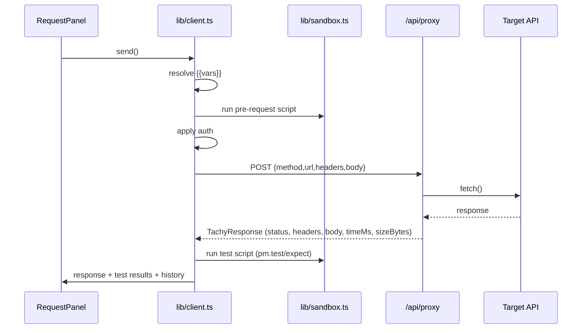

# Architecture

This document explains how Tachy is put together: the rendering model, the state
store, the request lifecycle, and the two server routes (proxy and mock).

## High-level

Tachy is a **Next.js 16 App Router** application. The entire workspace UI is a
client-side React 19 tree backed by a single **Zustand** store that persists to
`localStorage`. Two server routes provide the only backend surface:

- `app/api/proxy/route.ts` — executes real outbound HTTP requests on the server.
- `app/api/mock/[[...path]]/route.ts` — a built-in mock API for local testing.

```
Browser (React + Zustand, localStorage)
   │  fetch('/api/proxy', { method, url, headers, body })
   ▼
Next.js server route  ──►  Target API (any http/https host)
                          or
                      /api/mock/*  (built-in mock server)
```

There is no database in the running app. The `prisma/schema.prisma` file is a
**reference design** for a future collaborative backend; it is not wired up.

## Rendering model

- `src/app/layout.tsx` is the root layout. It mounts the `ThemeProvider`
  (`next-themes`, `class` strategy) and global styles.
- `src/app/page.tsx` renders the `Workspace` client component.
- Error boundaries: `error.tsx`, `global-error.tsx`, and `not-found.tsx` provide
  custom fallbacks. These also resolve a Next.js RSC manifest edge case that can
  appear if the dev server restarts mid-session.

## State model (Zustand)

The store in `src/lib/store.ts` is the single source of truth. It is wrapped with
the `persist` middleware:

- **Storage:** `localStorage` under a single key.
- **`partialize`:** only serializable domain data is persisted (collections,
  environments, globals, history, UI prefs) — transient runtime fields are excluded.
- **`onRehydrateStorage`:** sets a `hydrated` flag once the store is restored, so
  the UI can avoid a flash of un-persisted state and so first-run seeding is safe.

### First-run seeding

`setHydrated()` runs once after rehydration and **idempotently** seeds demo
content if it is missing (checked by name, so it never duplicates):

- the **Tachy Demo API** collection,
- the **🧪 Tachy Test Lab** collection (`buildTestLab()` in `src/lib/testlab.ts`),
- the **Local Mock** environment (`buildLocalEnv()`),
- **Development** / **Production** environments.

Because checks are by name, users can delete seeded items and they won't return
unless the name is absent again on a fresh store.

### Core entities (`src/lib/types.ts`)

- **Collection** → tree of **Nodes** (folders and requests).
- **RequestNode** → method, url, params, headers, auth, body, pre-request script,
  test script.
- **Environment** → named variable set; plus a separate **globals** set.
- **HistoryEntry** → a sent request + its response snapshot.
- **TachyResponse** → status, statusText, headers, body, `timeMs`, `sizeBytes`,
  cookies.

## Variable resolution (`src/lib/variables.ts`)

`{{variable}}` tokens are resolved at send time using a layered scope, with later
scopes overriding earlier ones:

```
globals  <  collection variables  <  active environment  <  request-local
```

Dynamic variables (e.g. `{{$timestamp}}`, `{{$randomUUID}}`, `{{$randomInt}}`)
are computed on each resolution pass. Secrets are masked in the UI but resolved
normally when a request is sent.

## Authorization (`src/lib/auth.ts`)

`AuthConfig` is converted into concrete request headers/query params:

- **Bearer** → `Authorization: Bearer <token>`
- **Basic** → `Authorization: Basic base64(user:pass)`
- **API Key** → header or query parameter (configurable)
- **JWT / OAuth 2.0 / Digest** → respective header construction

Auth is applied after variable resolution so tokens can come from environments.

## Request lifecycle

The flow, orchestrated by `src/lib/client.ts`:

1. **Resolve variables** across url, params, headers, body, and auth.
2. **Run the pre-request script** in the sandbox (`src/lib/sandbox.ts`), which can
   mutate environment/global variables before the request is built.
3. **Apply auth** to produce final headers/query.
4. **POST to `/api/proxy`** with the fully-resolved request descriptor.
5. The proxy performs the real `fetch`, measures timing and size, and returns a
   `TachyResponse`.
6. **Run the test script** in the sandbox against the response, collecting
   `pm.test` results.
7. **Persist** a `HistoryEntry` and update the response panel.



## The proxy route (`app/api/proxy/route.ts`)

The proxy exists so Tachy can call any API without browser CORS limits and report
**real** server-measured metrics. Design points:

- **Why server-side:** bypasses CORS, captures true latency/size, exposes raw
  response headers the browser would otherwise hide.
- **SSRF guardrails:** rejects requests to cloud metadata endpoints
  (`169.254.169.254`, `metadata.google.internal`) and enforces absolute
  `http(s)` URLs.
- **Timeout:** aborts after 60 seconds.
- **Return shape:** a normalized `TachyResponse` containing status, statusText,
  headers, body, `timeMs`, `sizeBytes`, and parsed cookies.
- **Runtime:** Node runtime, dynamic (never cached).

## The mock route (`app/api/mock/[[...path]]/route.ts`)

A catch-all route that implements a small but realistic API for local testing.
All HTTP verbs map to a single `handle` function that dispatches on the path. It
keeps an in-memory user store on `globalThis` (so it survives module reloads in
dev) seeded with sample records. Full endpoint reference lives in
[MOCK_SERVER.md](MOCK_SERVER.md).

- **Runtime:** `nodejs`
- **`dynamic = "force-dynamic"`** so every request is handled fresh.

## Styling & theming

- Tailwind CSS 3 with `darkMode: "class"`.
- Brand palette: navy `#0A1428`, cyan `#00F0FF`, grape `#A855F7`.
- Semantic tokens are CSS variables (`--bg`, `--surface`, `--elevated`,
  `--border`, `--fg`, `--muted`, `--accent`) defined in `globals.css`.
- The light defaults (`:root, .light`) are declared **before** the `.dark` block
  so dark overrides win at equal specificity — this ordering is what makes theme
  switching correct.

## Why this shape

- **Offline-first single store** keeps the MVP instant and backend-free while
  defining a stable UI contract that a real backend can later satisfy.
- **Server proxy + built-in mock** means the app is fully testable end-to-end on
  one machine with no external services.
- **Monaco everywhere** gives a VS Code-grade editing experience for JSON and
  scripts.
